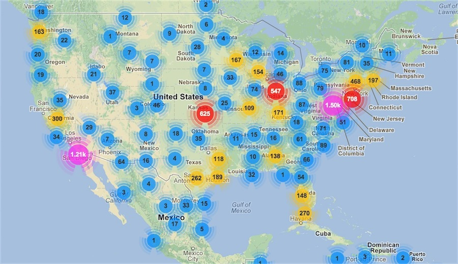

<!SLIDE smaller transition=growY>
# Scale?

<!SLIDE smaller transition=growY>
# What should you monitor

* KPI/CBP
* System Metrics are cheap to collect
* Model/View/Controller timings
* Bounds of your technologies (threads, request counts, JMX)
* GC Events
* Deployments/Change
* Alerts

<!SLIDE center transition=growY>

<!SLIDE small transition=growY>
# Other things to look at
* Riemann
* StatsD
* Uptime
* Information Dashboard Design (book)
* Pager Duty
* Watir
* Selenium
