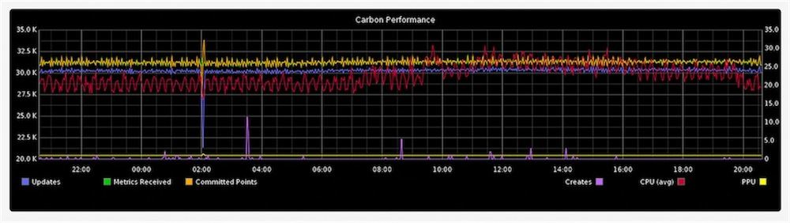

<!SLIDE center transition=scrollUp>
# Graphite
## scalable realtime graphing

<!SLIDE center transition=scrollUp>

<!SLIDE center transition=scrollUp>
* Time series database (whisper)

* Powerful rendering engine

<!SLIDE small bullets transition=scrollUp>
# RRD vs Whisper

* RRD can not take updates to a time-slot prior to its most recent update

* RRD was not designed with irregular updates in mind

* Whisper is slower; hundreds of microseconds (10^-4) which means less than a millisecond

<!SLIDE smaller transition=growX>
# Render URL API

##  http://graphite/render/?width=960&height=505&target=collectd.graphite.i-ac229dw1.cpu-0.cpu-idle
  * width=960
  * height=505
  * target=collectd.graphite.i-ac229dw1.cpu-0.cpu-idle

<!SLIDE center small bullets incremental>
# That's beginner stuff, how about

* derivative()

* drawAsInfinite()

* highestAverage()

* holtWintersAberration()

* logarithm()

* mostDeviant()

* 100's of ways to manipulate the data and graphs

<!SLIDE center>

