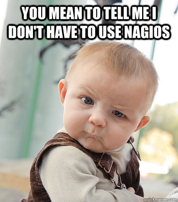

<!SLIDE center>
# All the Monitoring
 

## Bryan Brandau
### @agent462
### Sr. Manager of Operations, bestbuy.com
<!SLIDE bullets incremental transition=scrollUp>
# NO

* I'm not here to bash any tool
* I can if you want me to :)
## [I love to troll]

<!SLIDE bullets incremental transition=scrollUp>
# The Goal
## An open source monitoring system.
## Aims to be simple, malleable, and scalable.

* Compose a system - your requirements.

* Don't tie yourself to a single monolithic piece of software or service.

<!SLIDE center transition=growX>
# Choices

 Nagios
* Zabbix
* Ganglia
* Munin
* Zenoss
* Openmms
* OpenTSDB
* Icinga
* Graylog2
* Hyperic
* Diamond
* Shinken
* Cacti
* New Relic
* Loggly
* Stat Hat
* Ops Genie
* Twilio
* HP Openview

# 100's of other Enterprise products

<!SLIDE smaller incremental transition=fadeZoom>

# Okay, I left out a few but what do we need

* System metrics (CPU, memory, df, iostat, etc)
* Application metrics (error counts, latency, service timings)
* Log files
* Synthetic Monitoring (transactional)
* Rates, aggregates and state
* Graph everything

