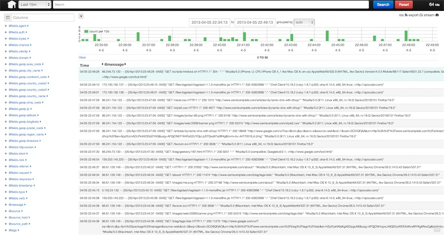

<!SLIDE transition=scrollUp>
# Logging

## Splunk is the best tool but costs real $ or 500MB per day free
## Logstash is a great free alternative

<!SLIDE center transition=scrollUp>
# Logstash
Open Source Log Management

## [ Ship Logs -> Parse -> Index -> Search ]

<!SLIDE center transition=scrollUp>
# Get Kibana
* Search
* Graph
* Score (Trend/Avg/Score)

<!SLIDE center transition=scrollUp>

<!SLIDE center transition=scrollUp>
# Logster

* Generate metrics from log files

* Parse log files but maintains cursor

* Graphite, Ganglia or Amazon CloudWatch

* Troll your logs

<!SLIDE small transition=scrollUp>
# Logs can be the heart and soul of metrics

* This should be your richest source of data
* If not, you're probably doing it wrong

