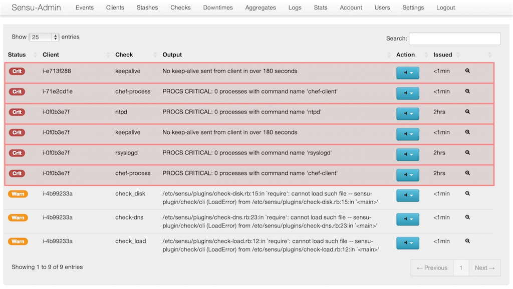
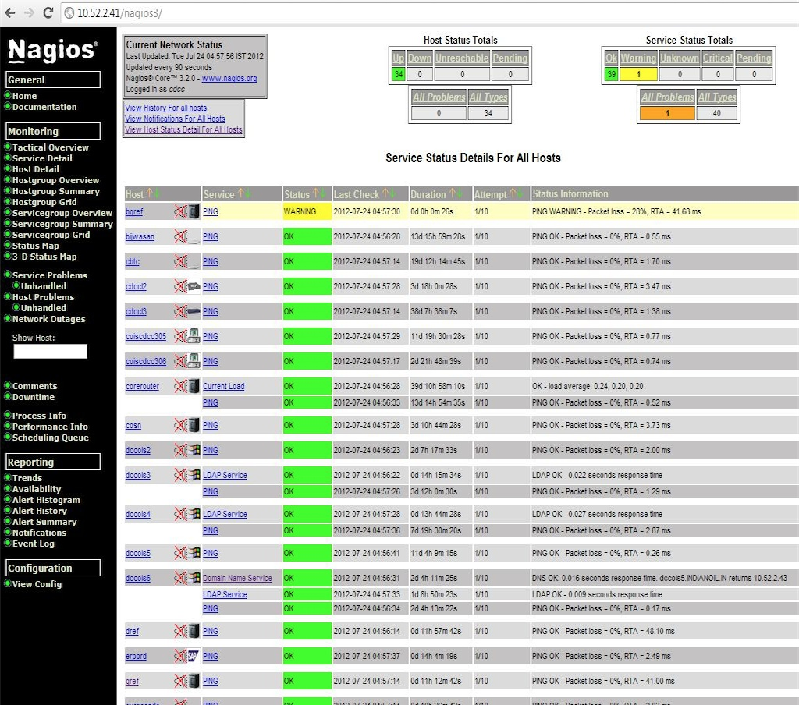
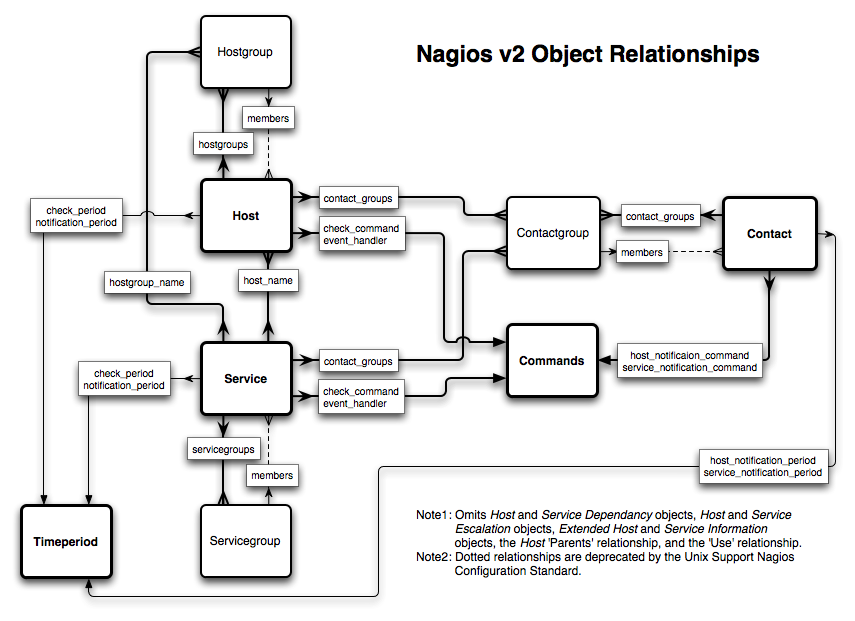
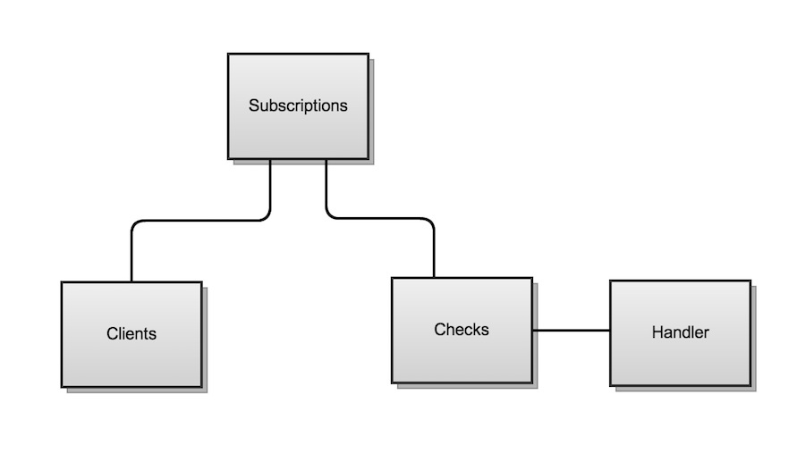

<!SLIDE center transition=scrollLeft>
# Sensu
## A monitoring router and framework

<!SLIDE center incremental>
# Only cares about bad state

<!SLIDE center incremental>
# VS Information overload

<!SLIDE center incremental>
# Or this

<!SLIDE center incremental>

<!SLIDE center incremental>

<!SLIDE transition=scrollUp>
# Check

## Result

## V

## Event

# Handler

<!SLIDE bullets transition=scrollUp>
# Check

* Outputs data* to STDOUT or STDERR.

* Uses exit status to indicate severity.

## 0: OK

## 1: WARNING

## 2: CRITICAL

## >= 3: UNKNOWN or CUSTOM

<!SLIDE code smaller transition=scrollUp>
    @@@ json
    {
      "checks": {
        "check_disk": {
          "command": "check-disk.rb -w 85 -c 95",
          "handlers": [
            "bby"
          ],
          "standalone": true,
          "interval": 30,
          "refresh": 1800,
          "occurrences": 2
        }
      }
    }
<!SLIDE code smallcode transition=scrollUp>
    @@@ json
    {
      "checks": {
        "chef-process": {
          "command": "PATH=$PATH:/usr/lib64/nagios/plugins check_procs -C chef-client -c 1:9",
          "handlers": [
            "bby"
          ],
          "standalone": true,
          "interval": 60,
          "refresh": 1800,
          "occurrences": 2
        }
      }
    }

<!SLIDE center bullets transition=scrollLeft>
* Every check result is inspected.

## Non-zero exit status?

## First zero exit status in a series?

## Marked as a metric?

## V

# Event

<!SLIDE center transition=scrollUp>
# Event Data

<!SLIDE code tinycode smaller transition=scrollUp>
    @@@
    {
      "client": {
        "name": "i-c903caf4",
        "address": "107.23.172.32",
        "subscriptions": [
          "web"
        ],
        "platform_version": "6.4",
        "chef_version": "11.4.0",
        "local_ipv4": "10.2.13.107",
        "placement": "us-east-1a",
      },
      check: {
        name: "frontend_http",
        command: "check_http -u http://example.com",
        subscribers: ["application"],
        handlers: ["pagerduty"],
        interval: 60,
        output: "HTTP/1.1 503 Service Temporarily Unavailable",
        status: 2,
        history: [0, 2],
        flapping: false,
        issued: 1364274239,
        executed: 1364274240
      },
      occurrences: 1,
      action: "create"
    }
